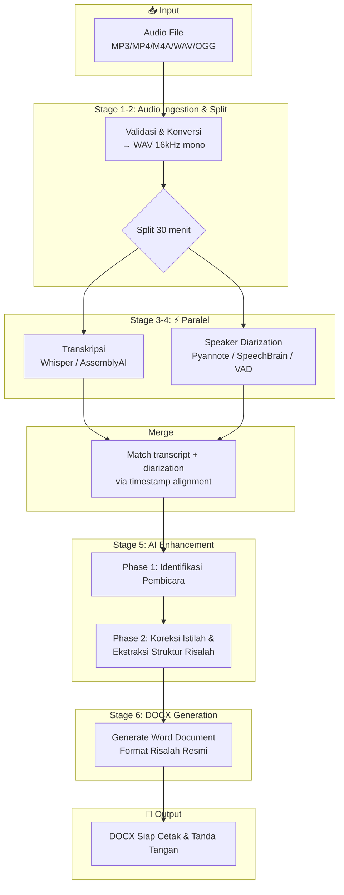
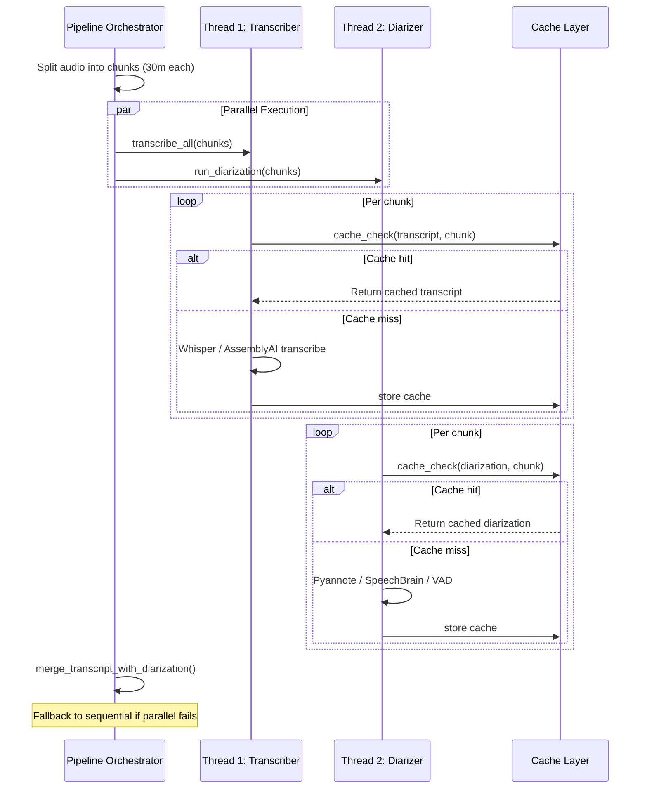
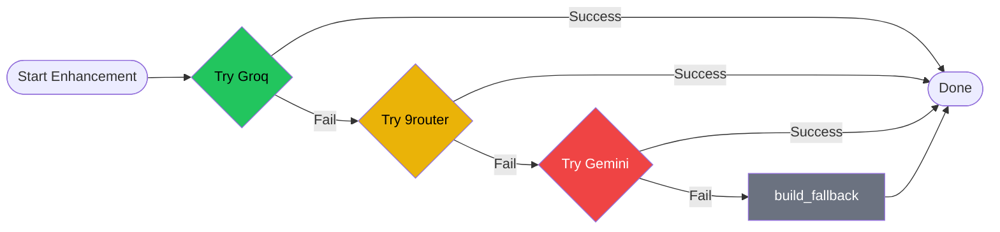
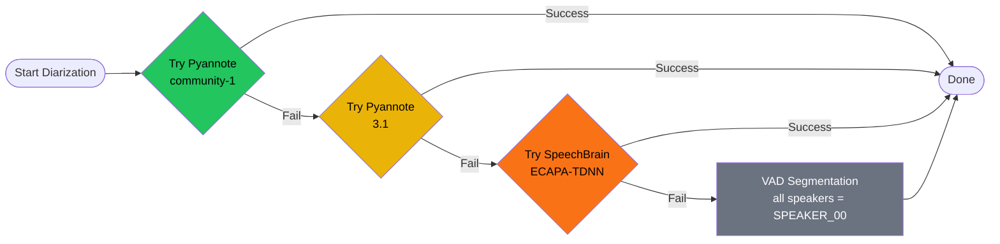
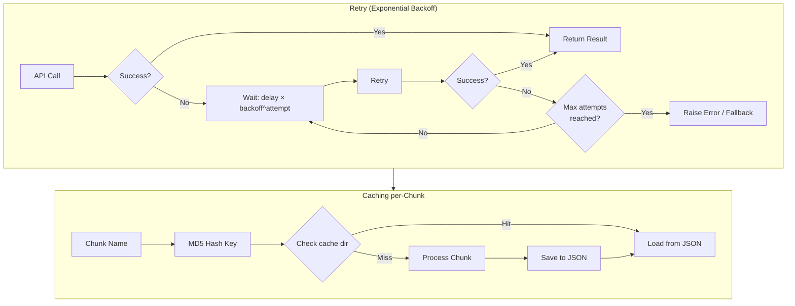
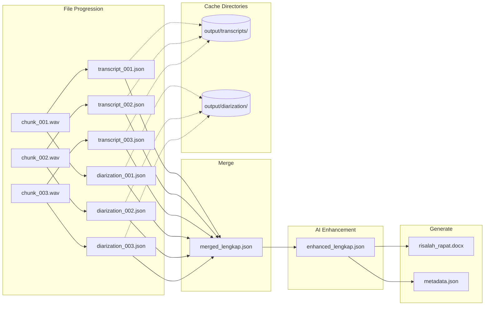
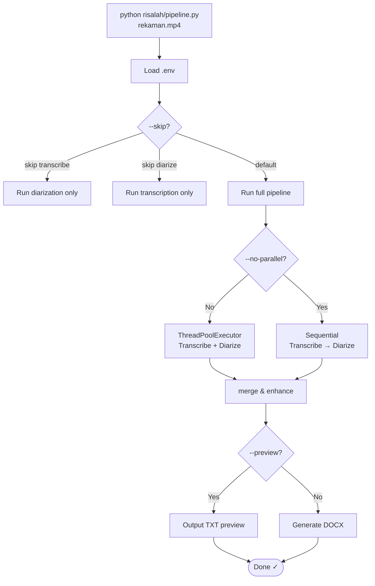

# Pipeline Workflow — Risalah Rapat Otomatis

## 1. High-Level Pipeline Flow

---

## 2. Detail Paralelisasi Stage 3 & 4

---

## 3. Fallback Chain — AI Enhancement

---

## 4. Fallback Chain — Speaker Diarization

---

## 5. Retry & Caching Mechanism

---

## 6. Data Flow Detail

---

## 7. Command Flow

---

## 8. Command Reference

| Command | Description |
|---------|-------------|
| `python risalah/pipeline.py <input>` | Full pipeline (parallel, cached, retry) |
| `--engine assemblyai` | Use AssemblyAI instead of Whisper |
| `--no-parallel` | Disable parallel Stage 3+4 |
| `--skip transcribe diarize` | Skip specified stages (use cache) |
| `--preview` | TXT output only, skip DOCX |
| `--overwrite` | Re-process all chunks (ignore cache) |

---

*Last updated: 2026-07-15*
